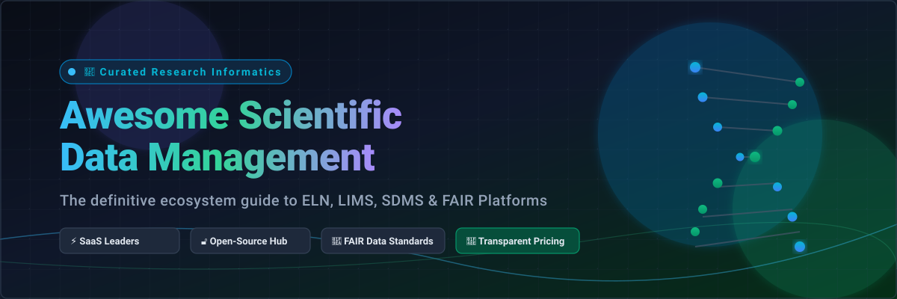

# Awesome-Scientific-Data-Management
  

## Top Scientific Data Management Platforms Ecosystem

**Curated List of SaaS Products & Open-Source GitHub Projects**

*Focused on Electronic Lab Notebooks (ELN), LIMS, SDMS, Sample & Experiment Tracking, FAIR Data & Research Data Management*

**Last updated: September 2026**

This repository tracks notable **SaaS platforms** and **open-source projects** for **Scientific Data Management**. These systems help research labs, biotech, pharma, and academic groups capture experiments, manage samples/inventory, integrate instrument data, enforce compliance (e.g. 21 CFR Part 11), and make scientific data findable, accessible, interoperable, and reusable (FAIR).

**Examples** include Dotmatics, IDBS, LabKey, Scispot, Benchling, TetraScience, Revvity Signals, Genedata, LabVantage, LabArchives, eLabNext, Collaborative Drug Discovery (CDD), Signals Notebook, BioRAFT, RSpace, SciNote, Labguru, Scitara, and SciSure (the category leaders).

**Open-source emphasis**: Scientific data management has mature, widely adopted open options. **eLabFTW**, **SciNote**, **RSpace** (open-sourced), **LabKey Server**, **openBIS**, **Chemotion**, and open LIMS projects (Senaite/Bika, etc.) provide production-capable alternatives for ELN, inventory, and research data workflows. This section is heavily expanded with these tools.

Contributions welcome! Open a PR to add/update entries. Keep descriptions factual and link to official sites.

## Table of Contents

- [SaaS/Hosted Platforms](#saashosted-platforms)

- [Open-Source GitHub Projects](#open-source-github-projects)

- [How to Contribute](#how-to-contribute)

- [Disclaimer](#disclaimer)

## SaaS/Hosted Platforms

| Platform | Description | Pricing (Starting / Base Tiers) | Free Tier Limits / Free Trial Details |
| :--- | :--- | :--- | :--- |
| **[Benchling](https://www.benchling.com/)** | Leading R&D cloud for life sciences featuring schema-driven ELN, molecular biology tools, registry, and inventory. | Starts at ~$15,000–$20,000/year (Startup program: ~$15k/year for ≤15 scientists & <$25M funding; Enterprise tiers scale higher) | **Free forever plan for academia**: full ELN and molecular biology design tools (excludes commercial Registry, Inventory, and workflow automation modules) |
| **[LabArchives](https://www.labarchives.com/)** | Widely used cloud ELN, inventory, and scheduler for academic, government, and biotech research labs. | ELN starts at ~$99–$140/user/year (Academic) and ~$330–$575/user/year (Commercial); Inventory add-on from $99/user/year (Academic) / $199/user/year (Commercial) | **Free forever plan (ELN Free Edition)**: max 2 notebooks, 1 GB total storage, max 25 MB per file upload (Scheduler Free: up to 5 users/resources; Inventory: 90-day free trial) |
| **[LabKey](https://www.labkey.com/)** | Research data management and specimen platform with cloud-hosted LIMS and biobank options. | Hosted Sample Manager Starter starts at $6,540/year (up to 5 users); SDMS Cloud Starter hosting from $5,000/year; LIMS Starter from $34,080/year (10 users) | **Free forever Community Edition**: open-source self-managed Apache 2.0 license (no cloud hosting or official SLA); **30-day free trial** available upon demo request for cloud editions |
| **[eLabNext](https://www.elabnext.com/)** | Lab management suite combining eLABJournal (ELN), eLABInventory, and sample tracking (part of SciSure). | Academic cloud tiers start from €12.95/user/month (~€155/user/year); Industry cloud tiers start from €34.95/user/month (~€420/user/year) | **30-day free trial** with full access to ELN, inventory, and sample tracking features (no perpetual free tier) |
| **[SciNote](https://www.scinote.net/)** | Top-rated ELN and inventory management system with GxP compliance and open-source foundation. | Paid cloud team/academic tiers start at ~$2,500–$5,000/year base depending on team size and regulatory add-ons (GxP / 21 CFR Part 11) | **Free forever plan for solo researchers**: strictly limited to 1 user (no team collaboration/sharing), max 50 MB per file attachment limit; **14-day free trial** available for Team/Enterprise plans |
| **[Scispot](https://www.scispot.com/)** | Modern life-science cloud combining SDMS, LIMS, and ELN capabilities with AI-driven workflow automation. | Starts at ~$10/user/month (~$120/user/year) for entry seats; core lab packages start at ~$3,000–$6,000/year base subscription | **14-day free trial** with complete access to LIMS, ELN templates, and automation builder (no perpetual free tier) |
| **[Revvity Signals (Signals Notebook)](https://www.revvity.com/)** | Cloud-native ELN and informatics platform featuring native ChemDraw integration and experiment workflows. | Standard Edition list price starts at $1,425/user/year (AWS Marketplace list contract at ~$1,325/user/year; implementation packages from ~$6,700) | **15-day free trial** per user for individual evaluation with ChemDraw and template features (excludes admin/enterprise tenant controls; no perpetual free tier) |
| **[Collaborative Drug Discovery (CDD Vault)](https://www.collaborativedrug.com/)** | Secure informatics platform for chemical and biological registration, assay data management, and SAR analysis. | Starter small-molecule / biology packages typically start around $3,000–$5,000/year for small biotech/academic labs (scales with data volume and modules) | **30-day guided free trial** with private sandbox vault upon demo request; standalone CDD Visualization tool and Public Access mining are permanently free |
| **[Labguru](https://www.labguru.com/)** | Web-based ELN, LIMS, and specimen inventory platform built for biotech teams and academic research labs. | Subscriptions typically start around $1,000/user/year (minimum team commitment usually required; entry lab packages start at ~$5,000–$10,000/year) | **14-day guided proof-of-concept trial** available upon scheduling a technical demo (no perpetual free tier) |
| **[Dotmatics](https://www.dotmatics.com/)** | Enterprise scientific informatics suite covering ELN, screening, chemistry, and biologics workflows. | Modular enterprise licenses start at ~$15,000–$25,000/year minimum entry deployment (bundled tools like GraphPad Prism start at $520/year; Geneious Prime from $4,700/year) | **14-to-30 day guided evaluation / PoC** following technical discovery (SnapGene / GraphPad tools within portfolio offer standalone 14-day and 30-day trials; no perpetual free tier) |
| **[IDBS (Polar / E-WorkBook)](https://www.idbs.com/)** | Regulated enterprise ELN and BioPharma lifecycle management platform for GxP/compliance environments. | Commercial deployments typically start at ~$25,000–$50,000/year base contract including infrastructure and CSV/GxP compliance modules | **30-day guided Proof-of-Concept (PoC)** sandbox environment provided during sales qualification (no perpetual free tier) |
| **[TetraScience](https://tetrascience.com/)** | Scientific data cloud and AI platform integrating laboratory instrument pipelines and data schemas. | Annual cloud subscriptions typically start at ~$25,000–$50,000/year base platform fee plus underlying AWS cloud data infrastructure costs | **30-day guided evaluation / pilot deployment** available through enterprise consultation or AWS Marketplace private offer (no perpetual free tier) |
| **[LabVantage](https://www.labvantage.com/)** | Enterprise LIMS and laboratory informatics system for sample tracking, biobanking, and quality control. | Hosted cloud subscriptions start at ~$250–$300/user/month (~$3,000–$3,600/user/year; enterprise lab setups start at ~$30,000–$50,000+ base) | **30-day guided sandbox demo/trial** provisioned during formal vendor evaluation (no perpetual free tier) |
| **[Genedata](https://www.genedata.com/)** | Biopharma software for large-scale screening (Screener), biologics (Biologics), and bioprocess data. | Enterprise modular installations typically start at ~$30,000–$60,000/year annual licensing per module depending on site size | **Guided pilot / PoC evaluation** (typically 30–60 days) with customer test data following scoping consultation (no perpetual free tier) |
| **[BioRAFT / SciShield](https://www.bioraft.com/)** | Lab safety, chemical inventory, and EHS compliance management platform (merged into SciSure). | Institutional subscriptions typically start at ~$5,000–$10,000/year base license for small facilities/departments | **30-day pilot / trial sandbox** provided during onboarding assessment and workflow scoping (no perpetual free tier) |
| **[Scitara](https://www.scitara.com/)** | Scientific Integration Platform (SIP) and Digital Lab Exchange (DLX) for connecting instruments and lab apps. | Annual platform subscriptions typically start at ~$15,000–$20,000/year based on connection endpoints and throughput | **30-day guided integration PoC** with selected lab instrument connections upon technical qualification (no perpetual free tier) |

## Open-Source GitHub Projects

- **[eLabFTW](https://github.com/elabftw/elabftw)**  

  The most popular open-source electronic lab notebook — experiments, resource database/inventory, timestamping, booking, import/export, and multi-team support. Actively maintained and widely self-hosted.

- **[SciNote](https://github.com/scinote-eln/scinote-web)**  

  Open-source ELN and lab management system for projects, experiments, protocols, inventory, and team collaboration (Mozilla Public License; commercial hosting/support available).

- **[RSpace](https://github.com/rspace-os)**  

  Open-source (AGPL) electronic lab notebook and inventory/RDM platform with strong integrations (GitHub, Figshare, Dataverse, Jupyter, etc.) and institutional deployment focus.

- **[LabKey Server](https://github.com/LabKey)**  

  Apache-licensed open-source platform for research data management, specimen tracking, study data, and integration — Community Edition widely used in biobanks and consortia.

- **[openBIS](https://openbis.ch/)**  

  Open-source ELN + LIMS developed at ETH Zurich — experiment tracking, inventory, FAIR data management, and strong life-science adoption.

- **[Chemotion ELN](https://github.com/ComPlat/chemotion_ELN)**  

  Open-source chemistry-focused ELN with structure drawing, reaction support, and research data management features (KIT Karlsruhe).

- **[Senaite / Bika LIMS](https://github.com/senaite)**  

  Open-source laboratory information management systems (Python/Plone) for sample workflows, QA, instruments, and lab operations.

- **[OpenELIS](https://github.com/)**  

  Open-source laboratory information system oriented toward clinical and public-health lab workflows.

- **[Baobab LIMS and biobank open tools](https://github.com/)**  

  Open LIMS projects focused on biospecimen and biobank management.

- **[Kadi4Mat and research data platforms](https://github.com/)**  

  Open research data management and ELN-style tools developed in academic environments.

### Additional Strong Open-Source Options

- Self-hosting **eLabFTW** as the default modern open ELN for most research groups.

- Using **LabKey** or **openBIS** when specimen/biobank and structured study data are central.

- Deploying **RSpace** or **SciNote** for institutional RDM with existing tool integrations.

- Combining open ELNs with **Jupyter**, Git, and data repositories for computational + wet-lab hybrid work.

- Adopting open LIMS (Senaite/Bika) for sample-centric or analytical labs that need workflow automation.

- Preferring open solutions in academia and early-stage biotech where budget and data ownership matter most; moving to commercial platforms when deep Part 11 validation, instrument fleets, or enterprise support are required.

**Frameworks for building custom systems**: Start with **eLabFTW** or **SciNote/RSpace** for the notebook + inventory layer, add **LabKey/openBIS** for structured research data, and layer open LIMS where sample workflows dominate. Export to FAIR repositories and use open analytics stacks. Commercial platforms (Benchling, Dotmatics, IDBS, LabArchives, Revvity Signals, LabVantage, CDD, etc.) still lead for polished molecular biology tools, large-scale instrument integration, validated GxP environments, and enterprise support/SLAs.

## How to Contribute

1. Fork the repo.

2. Add/edit entries in `README.md` (follow existing format).

3. Include: name, link, 1–2 sentence description, and whether it's SaaS or open-source.

4. Submit PR with a short explanation.

Star the repo if you find it useful!

## Disclaimer

- This is a **community-curated** list — not exhaustive and not an endorsement.

- Scientific data systems often handle regulated, IP-sensitive, or human-subject data. Open-source deployments must still meet institutional security, backup, audit-trail, and (where applicable) 21 CFR Part 11 / GLP / GMP requirements. Validation, change control, and SOPs remain the responsibility of the lab. Always involve IT, compliance, and scientific stakeholders in selection and configuration.

- This list is not regulatory or scientific advice.

---

**Made for lab scientists, research IT, biotech ops, and open-science advocates who want experiment data to be usable years later.**

Let's keep scientific records open, structured, and under the researchers’ control where possible.
